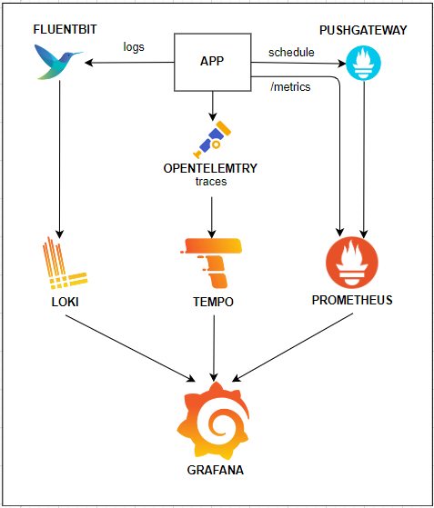
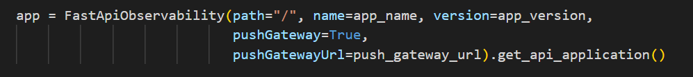
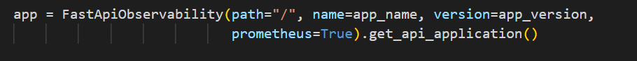

# LIB OBSERVABILITY

Este repositório contém uma stack de observabilidade para aplicações desenvolvidas em python com FastAPI. A Figura abaixo exemplifica a arquitetura proposta neste repositório.

## Pushgateway

O PushGateway nesta arquitetura é utilizado para casos onde o Prometheus não está acessível diretamente pela aplicação. Então, é necessário configurar a instância do PushGateway para que ele seja responsável em enviar as métricas ao Prometheus.

O PushGateway é opcional, podendo ser descartado quando a instância do Prometheus estiver com acesso direto a aplicação. 

Para o envio das métricas usando o PushGateway foi configurado um schedule para ser executado em uma thread a cada 10 segundos.

Para habilitar o PushGateway, adicione os parâmetros **'PushGateway'** com o valor **'true'** e **'PushGateway_url'** na inicalização da classe **FastAPIObservability**

O PushGateway está configurado para ouvir na porta **8001**, caso seja necessário alterar esta porta, basta modificar o parâmetro **'--web.listen-address'** no dockerfile para a porta desejada. É necessário também alterar a porta na configurações do docker-compose.yml.

## Prometheus

O prometheus foi definido como coletor/centralizador de métricas da aplicação. 

Caso deseja utilizar o **scrape** padrão do prometheus e assim expor o endpoint **/metrics** não é necessário instânciar o PushGateway. Para isso, configure o parâmetro **'Prometheus'** com o valor **'true'** na inicalização da classe **FastAPIObservability**

O Prometheus está configurado para ouvir na porta **8002**, caso seja necessário alterar esta porta, basta modificar o parâmetro **'--web.listen-address'** no dockerfile para a porta desejada. É necessário também alterar a porta na configurações do **scrape** (**prometheus.yml**) e no docker-compose.yml.

O Prometheus está configurado no modo **File-Based Service Discovery** e com um volume em **/etc/prometheus**. Quaisquer alterações nos targets presentes em **targets.json** são automaticamente detectadas pelo Prometheus, sem a necessidade de reiniciar a instância.

## Fluentbit

O fluentbit é usado como intermediário para envio dos logs ao **Loki**.

No arquivo **docker-compose.yml** é usada uma notação de __*logging*__ e configurando o envio dos logs do container da aplicação para o Fluentbit.

O Fluentbit por sua vez está configurado para adicionar uma label app ao log e encaminhar para a instância do Loki.

## Loki

O Loki está configurado para ser o centralizador de logs dessa stack. 

## Opentelemetry

O Opentelemetry é usado para configurar a rastreabilidade da nossa aplicação com a instrumentação automática de aplicações baseadas em FastAPI.

## Tempo

Os traces coletados pelo opentelemetry são enviados para a instância do Tempo.

## Grafana

O grafana é a ferramenta escolhida para criação dos dashboards contendo as informações coletadas por essa stack.

## Docker 

docker network create observability-network --driver bridge
git config core.autocrlf true
git config core.eol lf